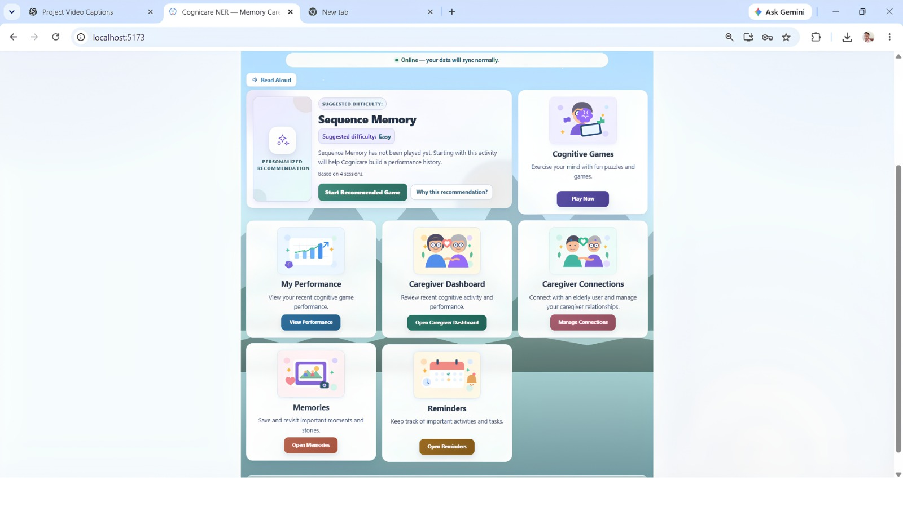
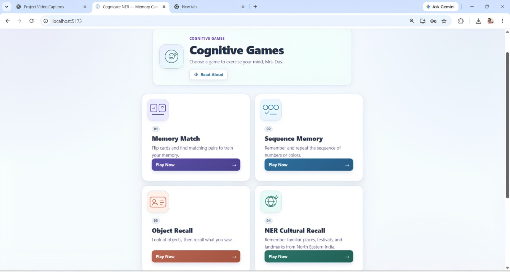
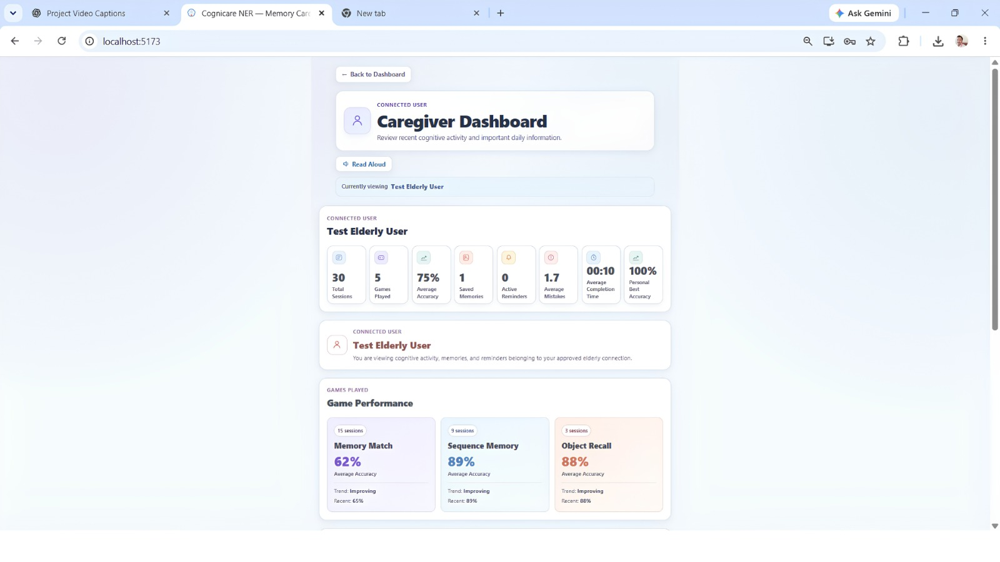

# 🧠 Cognicare NER

## AI-Based Cognitive Gaming and Memory Assistance Platform for Elderly Dementia Patients in North Eastern Region (NER)

<p align="center">
  <strong>Team NeuroCare</strong><br>
  <em>Hackathon Prototype • Cognitive Assistance • Memory Support • Elder-Friendly Technology</em>
</p>

---

## 🏆 Hackathon Project

| | |
|---|---|
| **Project Name** | Cognicare NER |
| **Team** | NeuroCare |
| Team Member | Contribution |
|---|---|
| **Mratunjay Gaur** | Project Lead / Development |
| **Saksham Singh** | Frontend Development |
| **Ayush Yadav** | Backend / Database |
| **Abhinav Gupta** | Testing / Research / Documentation |

| **Domain** | Healthcare • Assistive Technology • AI |
| **Focus** | Cognitive Assistance • Memory Support • Elder-Friendly Technology |
| **Regional Focus** | North Eastern Region of India (NER) |

> Cognicare NER is an assistive cognitive gaming and memory assistance platform designed to support elderly users through personalized cognitive activities, memory support, reminders, voice interaction, and caregiver-oriented functionality in a simple, elder-friendly digital experience.

---

# 🎥 Demo Video

## Cognicare NER Working Prototype

**▶️ [Watch the Cognicare NER Demo]<video controls src="Cognicare-Care_video_demo.mp4" title="Demo Link Video"></video>**

The demonstration is intended to showcase the working prototype, including the elderly dashboard, cognitive games, personalized recommendations, voice interaction, memories, reminders, caregiver functionality, and NER-focused cognitive content.


---

# 📌 Table of Contents

- [Overview](#-overview)
- [Problem Statement](#-problem-statement)
- [Our Solution](#-our-solution)
- [Key Features](#-key-features)
- [Application Modules](#-application-modules)
- [Personalization Engine](#-personalization-engine)
- [System Architecture](#-system-architecture)
- [How the System Works](#-how-the-system-works)
- [Technology Stack](#-technology-stack)
- [Database Architecture](#-database-architecture)
- [Repository Structure](#-repository-structure)
- [Installation & Local Setup](#-installation--local-setup)
- [Environment Variables](#-environment-variables)
- [Prototype Testing](#-prototype-testing)
- [Screenshots & UI Showcase](#-screenshots--ui-showcase)
- [Hackathon Alignment](#-hackathon-alignment)
- [Innovation](#-innovation)
- [Responsible Design](#-responsible-design)
- [Local Prototype & Evaluation](#-local-prototype--evaluation)
- [Future Scope](#-future-scope)
- [Project Status](#-project-status)
- [Demo & Presentation](#-demo--presentation)
- [Team & Contributors](#-team--contributors)

---

# 📖 Overview

**Cognicare NER** is a personalized cognitive gaming and memory assistance platform developed to support elderly users through accessible digital interaction.

The platform brings together:

- 🧠 Cognitive games
- 📊 Personalized activity recommendations
- 🗣️ Voice interaction
- 📸 Personal memories
- ⏰ Reminders
- 👨‍👩‍👧 Caregiver support
- 🌄 NER-focused cultural cognitive content

Instead of following exactly the same activity sequence for every user, the prototype uses activity-performance information such as **accuracy, response time, mistakes, and previous sessions** to help recommend suitable future activities.

### Our Design Principle

> **Technology should adapt to the user — not force the user to adapt to the technology.**

---

# ⚠️ Problem Statement

The hackathon problem focuses on developing an:

> **AI-Based Cognitive Gaming and Memory Assistance Platform for Elderly Dementia Patients in North Eastern Region (NER).**

Elderly users experiencing memory-related difficulties may benefit from regular cognitive engagement, familiar activities, reminders, and simple digital assistance.

### Key Challenges Addressed by Cognicare NER

#### 1. Generic Cognitive Activities

Many cognitive applications provide fixed activities without considering differences in user performance.

#### 2. Complex Digital Interfaces

Conventional applications may use navigation and interaction patterns that are not comfortable for every elderly user.

#### 3. Fragmented Assistance

Cognitive games, memories, reminders, and caregiver-oriented functions are often available as separate experiences.

#### 4. Limited Personalization

A single difficulty level or fixed activity sequence may not be appropriate for every user.

#### 5. Limited Voice Interaction

Typing and complex navigation can create an additional barrier for users who prefer speaking.

#### 6. Regional and Cultural Context

A platform focused on the North Eastern Region can benefit from culturally familiar content and region-specific cognitive activities.

---

# 💡 Our Solution

Cognicare NER combines cognitive engagement and everyday memory assistance in one elder-friendly platform.

## High-Level Flow

```text
                    ┌──────────────────────┐
                    │     Elderly User     │
                    │     Touch / Voice    │
                    └───────────┬──────────┘
                                │
                                ▼
                    ┌──────────────────────┐
                    │      React + PWA     │
                    │  Elder-Friendly UI   │
                    └───────────┬──────────┘
                                │
                           REST API / JSON
                                │
                                ▼
                    ┌──────────────────────┐
                    │       FastAPI        │
                    │  Authentication      │
                    │  Game Engine        │
                    │  Application APIs   │
                    └──────────┬───────────┘
                               │
                 ┌─────────────┴─────────────┐
                 │                           │
                 ▼                           ▼
        ┌────────────────┐       ┌────────────────────┐
        │   PostgreSQL   │       │ Personalization   │
        │    Database    │       │ & Recommendation  │
        │                │       │      Engine        │
        │ • Users        │       │ • Accuracy         │
        │ • Sessions     │       │ • Response Time    │
        │ • Memories     │       │ • Mistakes         │
        │ • Activity     │       │ • Session History  │
        └────────────────┘       └──────────┬─────────┘
                                             │
                                             ▼
                                    ┌────────────────────┐
                                    │ Recommended Next   │
                                    │ Cognitive Activity │
                                    └────────────────────┘
```

## Current Prototype Approach

The current demo uses a **rule-based personalization and recommendation engine** to adapt activity recommendations from recorded performance.

> The hackathon problem is AI-focused, while the current prototype demonstrates the personalization workflow using a deterministic recommendation approach. More advanced AI-assisted recommendation is kept as a future enhancement.

---

# 🌟 Key Features

## 🧠 Personalized Cognitive Games

The platform provides interactive activities designed to encourage memory, recall, attention, and concentration.

### 🎴 Memory Match

Users match corresponding items while exercising visual memory and recall.

### 🔢 Sequence Memory

Users observe a sequence and attempt to reproduce it, encouraging sequential memory and concentration.

### 🖼️ Object Recall

Users interact with objects and are later asked to recall previously presented information.

### 🌄 NER Cultural Recall

A region-focused cognitive activity designed to provide scope for culturally familiar content from the North Eastern Region.

---

## 📊 Personalized Recommendations

Cognicare NER records activity-performance indicators such as:

```text
Accuracy
   +
Response Time
   +
Mistakes
   +
Previous Sessions
        │
        ▼
Performance Analysis
        │
        ▼
Activity Recommendation
        │
        ▼
Next Cognitive Activity
```

This creates a continuous personalization loop instead of relying on one fixed activity sequence.

---

## 🗣️ Voice Interaction

Voice-based interaction provides an additional way for users to interact with the application.

The feature can help:

- Reduce dependence on typing
- Provide spoken input
- Make interaction more natural
- Improve accessibility for users who prefer voice interaction

---

## 📸 Personal Memories

The Memories feature allows users to maintain personal memories within the platform.

The goal is to provide a familiar and meaningful interaction layer beyond generic cognitive activities.

---

## ⏰ Reminders

Users can create and manage reminders for everyday activities and important events.

---

## 👨‍👩‍👧 Caregiver Support

Cognicare NER includes caregiver-oriented functionality to provide a broader support ecosystem around the elderly user.

The caregiver experience can provide visibility into relevant activity information and user engagement.

---

## 🌐 Elder-Friendly Interface

The interface is designed with elderly usability as a core consideration.

### Design Principles

- Large and clear controls
- Simple navigation
- Easy-to-understand labels
- Reduced interface complexity
- Voice interaction
- Accessible activity flows
- Familiar visual interaction patterns

---

# 🖥️ Application Modules

| # | Module | Purpose |
|---|---|---|
| 1 | **Dashboard** | Central entry point for cognitive activities, memories, reminders, and caregiver features |
| 2 | **Cognitive Games** | Access point for available cognitive activities |
| 3 | **Memory Match** | Visual memory matching activity |
| 4 | **Sequence Memory** | Sequential recall activity |
| 5 | **Object Recall** | Object-based memory activity |
| 6 | **NER Cultural Recall** | Region-focused cognitive activity |
| 7 | **Recommendations** | Suggests suitable next activities |
| 8 | **My Memories** | Personal memory assistance |
| 9 | **Reminders** | Everyday reminder management |
| 10 | **Voice Input** | Voice-based interaction |
| 11 | **Caregiver Dashboard** | Caregiver-oriented monitoring and support |
| 12 | **Authentication** | User authentication and session management |

---

# 🔄 Personalization Engine

Cognicare NER follows a performance-driven personalization workflow.

### Step 1 — User Starts an Activity

The elderly user selects and plays a cognitive activity.

### Step 2 — Performance is Recorded

The system records activity-related information such as:

- Accuracy
- Response time
- Mistakes
- Session information

### Step 3 — Performance is Analyzed

The recommendation engine evaluates recent activity performance.

### Step 4 — Next Activity is Recommended

The system selects a suitable activity based on recent performance.

### Step 5 — Personalization Continues

The next session contributes new performance data, allowing recommendations to continue adapting.

```text
                  ┌─────────────────┐
                  │   User Activity │
                  └────────┬────────┘
                           │
                           ▼
                  ┌─────────────────┐
                  │ Performance Data│
                  └────────┬────────┘
                           │
              ┌────────────┼────────────┐
              ▼            ▼            ▼
          Accuracy    Response Time   Mistakes
              │            │            │
              └────────────┼────────────┘
                           ▼
                ┌─────────────────────┐
                │ Personalization     │
                │ & Recommendation    │
                │ Engine              │
                └──────────┬──────────┘
                           │
                           ▼
                ┌─────────────────────┐
                │ Recommended Activity│
                └──────────┬──────────┘
                           │
                           ▼
                       New Session
                           │
                           └──────────────► Continuous Adaptation
```

---

# 🏗️ System Architecture

```text
                         ┌───────────────────┐
                         │    Elderly User   │
                         │    Touch / Voice  │
                         └─────────┬─────────┘
                                   │
                                   ▼
                         ┌───────────────────┐
                         │    React + PWA    │
                         │ Elder-Friendly UI │
                         └─────────┬─────────┘
                                   │
                                REST API
                                   │
                                   ▼
                         ┌───────────────────┐
                         │      FastAPI      │
                         │                   │
                         │ • Authentication  │
                         │ • Game Engine     │
                         │ • API Services    │
                         └────────┬──────────┘
                                  │
                    ┌─────────────┴─────────────┐
                    │                           │
                    ▼                           ▼
           ┌─────────────────┐       ┌────────────────────┐
           │    PostgreSQL   │       │ Personalization   │
           │                 │       │ & Recommendation  │
           │ • User Data     │       │ Engine             │
           │ • Sessions      │       │ • Accuracy         │
           │ • Memories      │       │ • Response Time    │
           │ • Activity Data │       │ • Mistakes         │
           └─────────────────┘       └─────────┬──────────┘
                                               │
                                               ▼
                                    ┌────────────────────┐
                                    │ Recommended Next   │
                                    │ Cognitive Activity │
                                    └────────────────────┘
```

---

# 🔄 How the System Works

### 1. User Interaction

The elderly user interacts with the application through touch-based controls or voice input.

### 2. Activity Selection

The user can choose a cognitive game or use a recommendation provided by the system.

### 3. Activity Session

The selected activity captures relevant performance information.

### 4. Data Storage

User, session, memory, and activity-related information is handled through the backend and PostgreSQL database.

### 5. Performance Evaluation

The personalization engine evaluates recent activity performance.

### 6. Recommendation

The recommendation system selects an appropriate next cognitive activity.

### 7. Caregiver Support

Relevant user activity information can be surfaced through caregiver-oriented functionality.

---

# 💻 Technology Stack

## Frontend

| Technology | Purpose |
|---|---|
| **React** | User interface |
| **Vite** | Frontend build tooling |
| **JavaScript** | Application logic |
| **HTML5** | Application structure |
| **CSS3** | Styling |
| **PWA** | Installable and app-like experience |

## Backend

| Technology | Purpose |
|---|---|
| **Python** | Backend development |
| **FastAPI** | REST API framework |
| **REST API** | Frontend-backend communication |
| **JSON** | Data exchange |

## Database

| Technology | Purpose |
|---|---|
| **PostgreSQL** | Persistent application data |

## Personalization

| Technology | Purpose |
|---|---|
| **Rule-Based Engine** | Activity personalization |
| **Recommendation System** | Next-activity selection |

---

# 🗄️ Database Architecture

The backend uses **PostgreSQL** for structured application data.

### User Data

- User profile
- Authentication-related information
- User preferences

### Session Data

- Activity sessions
- Performance information
- Session history

### Memory Data

- Personal memories
- Memory-related information

### Activity Data

- Cognitive activity performance
- Accuracy
- Response time
- Mistakes

This information supports application functionality and the personalization workflow.

---

# 📂 Repository Structure

A simplified structure of the project is shown below:

```text
cognicare-ner/
│
├── backend/
│   ├── routes/
│   ├── models/
│   ├── services/
│   ├── database/
│   ├── migrate_phase7.py
│   └── ...
│
├── src/
│   ├── Components/
│   ├── pages/
│   │   ├── CognitiveGames.jsx
│   │   ├── MemoryMatch.jsx
│   │   ├── SequenceMemory.jsx
│   │   ├── NERCulturalRecall.jsx
│   │   ├── RecommendationCard.jsx
│   │   ├── Reminders.jsx
│   │   ├── CaregiverDashboard.jsx
│   │   └── ...
│   │
│   ├── data/
│   ├── utils/
│   ├── App.jsx
│   └── ...
│
├── public/
│   └── Screenshots/
│
├── package.json
├── vite.config.js
├── README.md
└── ...
```

> The exact repository structure may evolve as the prototype continues to be improved.

---

# 🚀 Installation & Local Setup

## Prerequisites

Make sure the following are installed:

- **Node.js**
- **npm**
- **Python 3.x**
- **PostgreSQL**
- **Git**

---

## 1. Clone the Repository

```bash
git clone https://github.com/singhsaksham1903-cloud/NeuroCare.git
cd NeuroCare
```

> If you need a specific development branch, switch to that branch after cloning.

---

## 2. Install Frontend Dependencies

```bash
npm install
```

Start the frontend development server:

```bash
npm run dev
```

The Vite development server will normally provide a local URL such as:

```text
http://localhost:5173
```

---

## 3. Backend Setup

Open a second terminal and navigate to the backend directory:

```bash
cd backend
```

Create a Python virtual environment:

```bash
python -m venv .venv
```

Activate it on Windows:

```powershell
.venv\Scripts\activate
```

Install backend dependencies:

```bash
pip install -r requirements.txt
```

Start the FastAPI server:

```bash
uvicorn main:app --reload
```

The backend will normally be available at:

```text
http://127.0.0.1:8000
```

FastAPI interactive documentation:

```text
http://127.0.0.1:8000/docs
```

---

# 🔐 Environment Variables

Create the required environment configuration in the appropriate backend/frontend location.

Example:

```env
DATABASE_URL=your_postgresql_connection_string
```

### Important

**Never commit secrets or private credentials to GitHub.**

Do not upload:

- `.env` files containing secrets
- Database passwords
- API keys
- Authentication secrets
- Private credentials

For public repositories, use an `.env.example` file containing only placeholder values.

---

# 🧪 Prototype Testing

The Cognicare NER prototype has been tested across major application modules, including:

- Authentication
- Dashboard
- Cognitive Games
- Memory Match
- Sequence Memory
- Object Recall
- NER Cultural Recall
- Voice Interaction
- Personal Memories
- Reminders
- Caregiver functionality
- Recommendation functionality

### Testing Areas

- Functional correctness
- User interaction
- Navigation
- API communication
- Data flow
- Personalization behavior
- Elder-friendly usability

---

# 📸 Screenshots & UI Showcase

> **Note:** GitHub image paths are case-sensitive. Make sure the filenames and folder names match your repository exactly.

## 🏠 Elder-Friendly Dashboard

<p align="center">
  
</p>

The dashboard provides a simple entry point to cognitive activities and assistance features.

---

## 🧠 Cognitive Games

<p align="center">
  
</p>

The Cognitive Games section provides access to the available cognitive activities.

---

## 👨‍👩‍👧 Caregiver Dashboard

<p align="center">
  
</p>

The caregiver dashboard provides caregiver-oriented functionality and relevant user activity information.

---

# 🎯 Hackathon Alignment

Cognicare NER addresses the hackathon problem through several major design decisions.

### 🧓 Elder-Centric Design

The platform prioritizes simple navigation and accessible interactions for elderly users.

### 🧠 Cognitive Gaming

Multiple memory and recall activities are integrated into the same platform.

### 📊 Personalization

User performance is used to recommend suitable activities rather than following a single fixed sequence.

### 📸 Memory Assistance

Personal memories and reminders extend the platform beyond cognitive games.

### 🗣️ Voice Interaction

Voice-based interaction provides an additional input mechanism.

### 👨‍👩‍👧 Caregiver Support

Caregiver-oriented functionality creates a support ecosystem around the elderly user.

### 🌄 NER Focus

The project is designed around the North Eastern Region and includes scope for culturally familiar cognitive experiences.

---

# 🌟 Innovation

## 1. Performance-Based Personalization

The platform uses actual user interaction data to influence future activity recommendations.

## 2. Cognitive Assistance + Everyday Support

Cognicare NER combines cognitive activities with:

- Memories
- Reminders
- Voice interaction
- Caregiver functionality

in one platform.

## 3. Elder-First Interaction

The application is designed around usability for elderly users rather than assuming advanced digital literacy.

## 4. Regional Cognitive Content

NER Cultural Recall provides a foundation for introducing culturally familiar content into cognitive activities.

## 5. Continuous Personalization

Each activity session can contribute to future recommendations, creating a continuous feedback loop.

---

# 🔐 Responsible Design

Cognicare NER is intended as an **assistive technology platform**, not a clinical diagnostic system.

It focuses on:

- Cognitive engagement
- Memory assistance
- Personalized activities
- Everyday reminders
- Caregiver support

Personal information, sessions, memories, and activity-related data are handled through the application's backend and database.

## ⚠️ Medical Disclaimer

> **Cognicare NER is NOT intended to diagnose dementia, Alzheimer's disease, or any other medical condition.**

Activity performance is used for personalization and assistance within the prototype and should not be interpreted as a clinical diagnosis or medical assessment.

---

# 📴 Local Prototype & Evaluation

The current project is maintained primarily as a **hackathon prototype** for local development, testing, demonstration, and evaluation.

The current scope focuses on demonstrating:

- The core concept
- Cognitive activity flows
- Personalization workflow
- Memory assistance
- Caregiver functionality
- Elder-friendly interaction

The current prototype is not positioned as a production medical deployment.

---

# 🔮 Future Scope

### 🌐 Multilingual Support

Expand language support for users across the North Eastern Region.

### 🧠 Advanced Personalization

Explore more advanced adaptive models using larger amounts of activity data.

### 🏞️ Expanded NER Cultural Activities

Introduce more culturally familiar memory prompts, objects, stories, places, and activities from the North Eastern Region.

### 🗣️ Improved Voice Assistance

Develop a richer voice-guided experience and broader voice navigation.

### 📊 Advanced Caregiver Analytics

Provide more detailed activity summaries and long-term engagement insights for caregivers.

### ♿ Accessibility Improvements

Further improve text sizing, contrast, audio guidance, navigation, and accessibility controls.

### 🤖 AI-Assisted Personalization

Future versions can explore stronger AI-assisted recommendation and personalization capabilities while keeping the system responsible, transparent, and assistive.

---

# 📌 Project Status

**Status: 🚧 Hackathon Prototype**

Cognicare NER is a functional prototype demonstrating personalized cognitive activities and memory assistance for elderly users.

The project is intended for:

- Hackathon demonstration
- Prototype evaluation
- Academic/project presentation
- Further research and development

---

# 🎥 Demo & Presentation

## 🎬 Demo Video

**[▶️ Watch Cognicare NER Demo]<video controls src="Cognicare-Care_video_demo.mp4" title="Cognicare Demo Video Link"></video>**

## 📊 Hackathon Presentation

**[View Cognicare NER Presentation](ADD_PRESENTATION_LINK_HERE)**

## 🗂️ Project Repository

**NeuroCare — Cognicare NER**

https://github.com/singhsaksham1903-cloud/NeuroCare

---

# 👥 Team & Contributors

## Team NeuroCare

| Team Member | Contribution |
|---|---|
| **Mratunjay Gaur** | Project Lead / Development |
| **Saksham Singh** | Frontend Development |
| **Ayush Yadav** | Backend / Database |
| **Abhinav Gupta** | Testing / Research / Documentation |

---

# ❤️ Our Vision

We believe elderly users deserve technology that is:

**Simple. Accessible. Personalized. Meaningful.**

Cognicare NER aims to combine cognitive engagement and everyday assistance into a platform that feels natural and supportive for elderly users.

> **Technology should adapt to people — not force people to adapt to technology.**

---

## 🧠 Cognicare NER

### Team NeuroCare

**Hackathon Prototype • Cognitive Assistance • Memory Support • Elder-Friendly Technology**